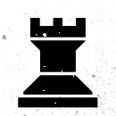
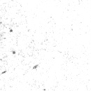
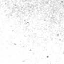
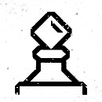
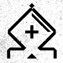
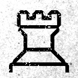
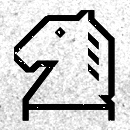

|   | a | b | c | d | e | f | g | h |
|---|---|---|---|---|---|---|---|---|
| 8 |  |  |  |  |  |  |  |  |
| 7 |  |  |  |  |  |  |  |  |
| 6 |  |  |  |  |  |  |  |  |
| 5 |  |  |  |  |  |  |  |  |
| 4 |  |  |  |  |  |  |  |  |
| 3 |  |  |  |  |  |  |  |  |
| 2 |  |  |  |  |  |  |  |  |
| 1 |  |  |  |  |  |  |  |  |
|   | a | b | c | d | e | f | g | h |

| From |  To  |
|------|------|
|  e2  | [h5](https://github.com/tanishq-singh-2407/readme-chess/issues/new?title=chess_move_e2h5&labels=make+move&body=Just+push+%27Submit+new+issue%27.+You+don%27t+need+to+do+anything+else.), [g4](https://github.com/tanishq-singh-2407/readme-chess/issues/new?title=chess_move_e2g4&labels=make+move&body=Just+push+%27Submit+new+issue%27.+You+don%27t+need+to+do+anything+else.), [f3](https://github.com/tanishq-singh-2407/readme-chess/issues/new?title=chess_move_e2f3&labels=make+move&body=Just+push+%27Submit+new+issue%27.+You+don%27t+need+to+do+anything+else.), [d3](https://github.com/tanishq-singh-2407/readme-chess/issues/new?title=chess_move_e2d3&labels=make+move&body=Just+push+%27Submit+new+issue%27.+You+don%27t+need+to+do+anything+else.), [f1](https://github.com/tanishq-singh-2407/readme-chess/issues/new?title=chess_move_e2f1&labels=make+move&body=Just+push+%27Submit+new+issue%27.+You+don%27t+need+to+do+anything+else.) |
|  g1  | [h3](https://github.com/tanishq-singh-2407/readme-chess/issues/new?title=chess_move_g1h3&labels=make+move&body=Just+push+%27Submit+new+issue%27.+You+don%27t+need+to+do+anything+else.), [f3](https://github.com/tanishq-singh-2407/readme-chess/issues/new?title=chess_move_g1f3&labels=make+move&body=Just+push+%27Submit+new+issue%27.+You+don%27t+need+to+do+anything+else.) |
|  e1  | [f1](https://github.com/tanishq-singh-2407/readme-chess/issues/new?title=chess_move_e1f1&labels=make+move&body=Just+push+%27Submit+new+issue%27.+You+don%27t+need+to+do+anything+else.) |
|  d1  | [a4](https://github.com/tanishq-singh-2407/readme-chess/issues/new?title=chess_move_d1a4&labels=make+move&body=Just+push+%27Submit+new+issue%27.+You+don%27t+need+to+do+anything+else.), [b3](https://github.com/tanishq-singh-2407/readme-chess/issues/new?title=chess_move_d1b3&labels=make+move&body=Just+push+%27Submit+new+issue%27.+You+don%27t+need+to+do+anything+else.), [c2](https://github.com/tanishq-singh-2407/readme-chess/issues/new?title=chess_move_d1c2&labels=make+move&body=Just+push+%27Submit+new+issue%27.+You+don%27t+need+to+do+anything+else.) |
|  b1  | [c3](https://github.com/tanishq-singh-2407/readme-chess/issues/new?title=chess_move_b1c3&labels=make+move&body=Just+push+%27Submit+new+issue%27.+You+don%27t+need+to+do+anything+else.), [a3](https://github.com/tanishq-singh-2407/readme-chess/issues/new?title=chess_move_b1a3&labels=make+move&body=Just+push+%27Submit+new+issue%27.+You+don%27t+need+to+do+anything+else.) |
|  e4  | [e5](https://github.com/tanishq-singh-2407/readme-chess/issues/new?title=chess_move_e4e5&labels=make+move&body=Just+push+%27Submit+new+issue%27.+You+don%27t+need+to+do+anything+else.) |
|  h2  | [h3](https://github.com/tanishq-singh-2407/readme-chess/issues/new?title=chess_move_h2h3&labels=make+move&body=Just+push+%27Submit+new+issue%27.+You+don%27t+need+to+do+anything+else.), [h4](https://github.com/tanishq-singh-2407/readme-chess/issues/new?title=chess_move_h2h4&labels=make+move&body=Just+push+%27Submit+new+issue%27.+You+don%27t+need+to+do+anything+else.) |
|  g2  | [g3](https://github.com/tanishq-singh-2407/readme-chess/issues/new?title=chess_move_g2g3&labels=make+move&body=Just+push+%27Submit+new+issue%27.+You+don%27t+need+to+do+anything+else.), [g4](https://github.com/tanishq-singh-2407/readme-chess/issues/new?title=chess_move_g2g4&labels=make+move&body=Just+push+%27Submit+new+issue%27.+You+don%27t+need+to+do+anything+else.) |
|  f2  | [f3](https://github.com/tanishq-singh-2407/readme-chess/issues/new?title=chess_move_f2f3&labels=make+move&body=Just+push+%27Submit+new+issue%27.+You+don%27t+need+to+do+anything+else.), [f4](https://github.com/tanishq-singh-2407/readme-chess/issues/new?title=chess_move_f2f4&labels=make+move&body=Just+push+%27Submit+new+issue%27.+You+don%27t+need+to+do+anything+else.) |
|  d2  | [d3](https://github.com/tanishq-singh-2407/readme-chess/issues/new?title=chess_move_d2d3&labels=make+move&body=Just+push+%27Submit+new+issue%27.+You+don%27t+need+to+do+anything+else.), [d4](https://github.com/tanishq-singh-2407/readme-chess/issues/new?title=chess_move_d2d4&labels=make+move&body=Just+push+%27Submit+new+issue%27.+You+don%27t+need+to+do+anything+else.) |
|  b2  | [b3](https://github.com/tanishq-singh-2407/readme-chess/issues/new?title=chess_move_b2b3&labels=make+move&body=Just+push+%27Submit+new+issue%27.+You+don%27t+need+to+do+anything+else.), [b4](https://github.com/tanishq-singh-2407/readme-chess/issues/new?title=chess_move_b2b4&labels=make+move&body=Just+push+%27Submit+new+issue%27.+You+don%27t+need+to+do+anything+else.) |
|  a2  | [a3](https://github.com/tanishq-singh-2407/readme-chess/issues/new?title=chess_move_a2a3&labels=make+move&body=Just+push+%27Submit+new+issue%27.+You+don%27t+need+to+do+anything+else.), [a4](https://github.com/tanishq-singh-2407/readme-chess/issues/new?title=chess_move_a2a4&labels=make+move&body=Just+push+%27Submit+new+issue%27.+You+don%27t+need+to+do+anything+else.) |

|||_Human_||||_Stockfish_||
|-|-|:-:|-|:-:|:-:|:-:|:-:|
|**No**|**Date and Time**|**Profile Pic**|**Username**|**From**|**To**|**From**|**To**|
|1|`17/12/24`, `17:08:46`| | [`oyetanishq`](https://github.com/oyetanishq)|`c2`|`c4`|`g7`|`g6`|
|2|`10/12/24`, `17:25:07`| | [`tanishq-singh-2407`](https://github.com/tanishq-singh-2407)|`f1`|`e2`|`b8`|`c6`|
|3|`04/08/24`, `10:30:14`| | [`utkarsh-gupt-a`](https://github.com/utkarsh-gupt-a)|`e2`|`e4`|`c7`|`c5`|

| game | count |
|------|-------|
| humans | 0 |
| stockfish | 2 |
| draw | 0 |

